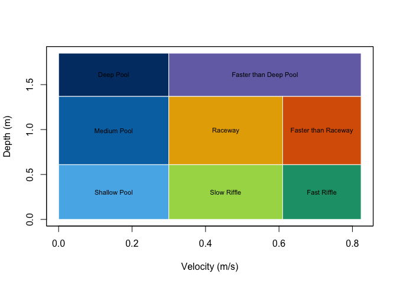

# hydromeso

<!-- badges: start -->

Development status: version 0.1.0; not yet on CRAN. <!-- badges: end -->

`hydromeso` classifies water depth and velocity into nominal fluvial
hydraulic mesohabitat categories. It supports numeric values, ordinary
tables, `terra::SpatVector` features, rasters, multiple hydraulic
scenarios, and validated custom rectangular schemes. Its only non-base
runtime dependency is `terra`.

## Installation

``` r
# From a local source checkout:
install.packages("hydromeso", repos = NULL, type = "source")
```

## Default classification

The authoritative default uses metres and metres per second. Lower
bounds are inclusive and upper bounds are exclusive.

| Class | Mesohabitat           | Depth (m)            | Velocity (m/s)       |
|------:|:----------------------|:---------------------|:---------------------|
|     1 | Shallow Pool          | \< 0.61              | \< 0.30              |
|     2 | Medium Pool           | \>= 0.61 and \< 1.37 | \< 0.30              |
|     3 | Deep Pool             | \>= 1.37             | \< 0.30              |
|     4 | Slow Riffle           | \< 0.61              | \>= 0.30 and \< 0.61 |
|     5 | Fast Riffle           | \< 0.61              | \>= 0.61             |
|     6 | Raceway               | \>= 0.61 and \< 1.37 | \>= 0.30 and \< 0.61 |
|     7 | Faster than Raceway   | \>= 0.61 and \< 1.37 | \>= 0.61             |
|     8 | Faster than Deep Pool | \>= 1.37             | \>= 0.30             |

``` r
plot_meso_scheme()
```



## Quick examples

``` r
classify_mesohabitat_values(
  depth = c(0, 0.61, 1.37, NA),
  velocity = c(0, 0.30, 0.61, 0.2)
)
#>   depth velocity mesohabitat_class           mesohabitat
#> 1  0.00     0.00                 1          Shallow Pool
#> 2  0.61     0.30                 6               Raceway
#> 3  1.37     0.61                 8 Faster than Deep Pool
#> 4    NA     0.20                NA                  <NA>
```

``` r
classified <- classify_mesohabitat_table(
  hydromeso_example, "depth", "velocity"
)
head(classified)
#>        x       y depth velocity mesohabitat_class  mesohabitat
#> 1 500000 4400000   0.2      0.1                 1 Shallow Pool
#> 2 500010 4400010   0.8      0.1                 2  Medium Pool
#> 3 500020 4400020   1.5      0.1                 3    Deep Pool
#> 4 500030 4400030   0.2      0.4                 4  Slow Riffle
#> 5 500040 4400040   0.2      0.8                 5  Fast Riffle
#> 6 500050 4400050   0.8      0.4                 6      Raceway
summarize_mesohabitat(classified)
#>   class_id                 label record_count percentage missing_count
#> 1        1          Shallow Pool            3  17.647059             1
#> 2        2           Medium Pool            3  17.647059             1
#> 3        3             Deep Pool            2  11.764706             1
#> 4        4           Slow Riffle            2  11.764706             1
#> 5        5           Fast Riffle            2  11.764706             1
#> 6        6               Raceway            2  11.764706             1
#> 7        7   Faster than Raceway            2  11.764706             1
#> 8        8 Faster than Deep Pool            1   5.882353             1
```

``` r
points <- mesohabitat_example_vector()
classified_points <- classify_mesohabitat_vector(points, "depth", "velocity")
classified_points
#> class       : SpatVector
#> geometry    : points
#> dimensions  : 18, 4  (geometries, attributes)
#> extent      : 500000, 500170, 4400000, 4400170  (xmin, xmax, ymin, ymax)
#> coord. ref. : WGS 84 / UTM zone 15N (EPSG:32615)
#> names       : depth velocity mesohabitat_class  mesohabitat
#> type        : <num>    <num>             <int>        <chr>
#> values      :   0.2      0.1                 1 Shallow Pool
#>                 0.8      0.1                 2  Medium Pool
#>                 1.5      0.1                 3    Deep Pool
#>               ...
```

``` r
hydraulics <- mesohabitat_example_rasters()
classes <- classify_mesohabitat_raster(hydraulics$depth, hydraulics$velocity)
classes
#> class       : SpatRaster
#> size        : 230, 445, 1  (nrow, ncol, nlyr)
#> resolution  : 18, 18  (x, y)
#> extent      : 1725550, 1733560, 312049.5, 316189.5  (xmin, xmax, ymin, ymax)
#> coord. ref. : +proj=lcc +lat_0=38.3333333333333 +lon_0=-98 +lat_1=38.7166666666667 +lat_2=39.7833333333333 +x_0=400000 +y_0=0 +ellps=GRS80 +units=us-ft +no_defs
#> source(s)   : memory
#> categories  : mesohabitat
#> name        :           mesohabitat
#> min value   :          Shallow Pool
#> max value   : Faster than Deep Pool
summarize_mesohabitat(classes)
#>      scenario class_id                 label cell_count    area_m2   hectares
#> 1 mesohabitat        1          Shallow Pool        470  14148.535  1.4148535
#> 2 mesohabitat        2           Medium Pool        205   6171.170  0.6171170
#> 3 mesohabitat        3             Deep Pool        130   3913.425  0.3913425
#> 4 mesohabitat        4           Slow Riffle        823  24774.986  2.4774986
#> 5 mesohabitat        5           Fast Riffle        115   3461.876  0.3461876
#> 6 mesohabitat        6               Raceway       1036  31186.982  3.1186982
#> 7 mesohabitat        7   Faster than Raceway       3951 118937.996 11.8937996
#> 8 mesohabitat        8 Faster than Deep Pool      14604 439628.086 43.9628086
#>   square_kilometres       acres percentage
#> 1       0.014148535   3.4961791  2.2030562
#> 2       0.006171170   1.5249293  0.9609076
#> 3       0.003913425   0.9670284  0.6093560
#> 4       0.024774986   6.1220325  3.8576918
#> 5       0.003461876   0.8554481  0.5390457
#> 6       0.031186982   7.7064710  4.8560981
#> 7       0.118937996  29.3902190 18.5197332
#> 8       0.439628086 108.6344659 68.4541114
```

Custom schemes use the same engine:

``` r
rules <- data.frame(
  class_id = c(1L, 2L), label = c("Slow", "Fast"),
  depth_min = c(0, 0), depth_max = c(Inf, Inf),
  velocity_min = c(0, 0.5), velocity_max = c(0.5, Inf)
)
custom <- meso_scheme(rules, name = "Two velocity classes")
classify_mesohabitat_values(c(0.2, 1), c(0.2, 0.8), custom)
#>   depth velocity mesohabitat_class mesohabitat
#> 1   0.2      0.2                 1        Slow
#> 2   1.0      0.8                 2        Fast
```

## Interpretation and citation

The output is a depth-velocity hydraulic classification, not proof of
habitat quality or fish occupancy. Interpretation depends on species and
life stage, stream type, substrate, cover, connectivity, water quality,
temperature, flow regime, hydraulic-model resolution, and local
validation. Class IDs are labels, not ordinal scores. Users must decide
how dry cells are represented in their own HEC-RAS or other model
outputs; `dry_threshold = NULL` preserves the exact scheme and
classifies zero depth and zero velocity as Class 1.

The default eight-class table is from Cordero and Harris (Preprint),
*Semi-Supervised and Supervised Machine Learning Approaches to
Predicting Fluvial Mesohabitats from Satellite Data*, DOI:
`10.2139/ssrn.7100727`. The broader framework is informed by Aadland
(1993), *Stream Habitat Types: Their Fish Assemblages and Relationship
to Flow*, DOI: `10.1577/1548-8675(1993)013<0790:SHTTFA>2.3.CO;2`.

Source code and issue tracking are available at
[github.com/el-cordero/hydromeso](https://github.com/el-cordero/hydromeso).
