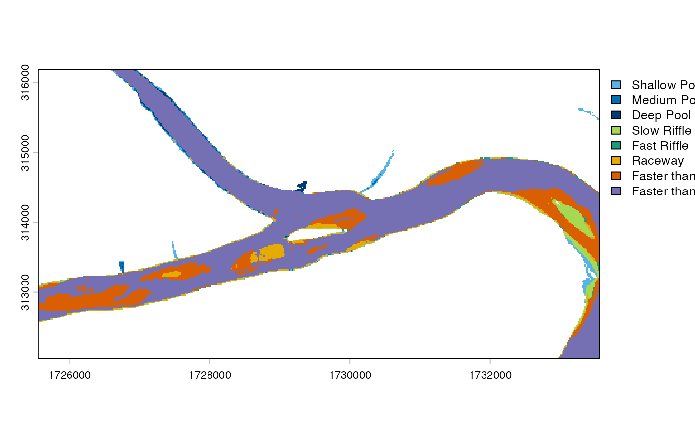

# Getting started with hydromeso

``` r

library(hydromeso)
```

`hydromeso` classifies depth and velocity into nominal hydraulic
mesohabitats. Install a local source package with
`install.packages(path, repos = NULL, type = "source")`.

## Exact default table

``` r

meso_scheme_rules(meso_scheme_default())
```

    ##   class_id                 label depth_min depth_max velocity_min velocity_max
    ## 1        1          Shallow Pool      0.00      0.61         0.00         0.30
    ## 2        2           Medium Pool      0.61      1.37         0.00         0.30
    ## 3        3             Deep Pool      1.37       Inf         0.00         0.30
    ## 4        4           Slow Riffle      0.00      0.61         0.30         0.61
    ## 5        5           Fast Riffle      0.00      0.61         0.61          Inf
    ## 6        6               Raceway      0.61      1.37         0.30         0.61
    ## 7        7   Faster than Raceway      0.61      1.37         0.61          Inf
    ## 8        8 Faster than Deep Pool      1.37       Inf         0.30          Inf

All lower bounds are inclusive and all upper bounds are exclusive. Exact
depths 0.61 and 1.37 enter the medium and deep ranges; exact velocities
0.30 and 0.61 enter the moderate and high ranges.

## Values and tables

``` r

classify_mesohabitat_values(c(0, 0.61, 1.37), c(0, 0.30, 0.61))
```

    ##   depth velocity mesohabitat_class           mesohabitat
    ## 1  0.00     0.00                 1          Shallow Pool
    ## 2  0.61     0.30                 6               Raceway
    ## 3  1.37     0.61                 8 Faster than Deep Pool

``` r

tab <- classify_mesohabitat_table(hydromeso_example, "depth", "velocity")
summarize_mesohabitat(tab)
```

    ##   class_id                 label record_count percentage missing_count
    ## 1        1          Shallow Pool            3  17.647059             1
    ## 2        2           Medium Pool            3  17.647059             1
    ## 3        3             Deep Pool            2  11.764706             1
    ## 4        4           Slow Riffle            2  11.764706             1
    ## 5        5           Fast Riffle            2  11.764706             1
    ## 6        6               Raceway            2  11.764706             1
    ## 7        7   Faster than Raceway            2  11.764706             1
    ## 8        8 Faster than Deep Pool            1   5.882353             1

## Rasters and export

``` r

h <- mesohabitat_example_rasters()
r <- classify_mesohabitat_raster(h$depth, h$velocity)
summarize_mesohabitat(r)
```

    ##      scenario class_id                 label cell_count    area_m2   hectares
    ## 1 mesohabitat        1          Shallow Pool        470  14148.535  1.4148535
    ## 2 mesohabitat        2           Medium Pool        205   6171.170  0.6171170
    ## 3 mesohabitat        3             Deep Pool        130   3913.425  0.3913425
    ## 4 mesohabitat        4           Slow Riffle        823  24774.986  2.4774986
    ## 5 mesohabitat        5           Fast Riffle        115   3461.876  0.3461876
    ## 6 mesohabitat        6               Raceway       1036  31186.982  3.1186982
    ## 7 mesohabitat        7   Faster than Raceway       3951 118937.996 11.8937996
    ## 8 mesohabitat        8 Faster than Deep Pool      14604 439628.086 43.9628086
    ##   square_kilometres       acres percentage
    ## 1       0.014148535   3.4961791  2.2030562
    ## 2       0.006171170   1.5249293  0.9609076
    ## 3       0.003913425   0.9670284  0.6093560
    ## 4       0.024774986   6.1220325  3.8576918
    ## 5       0.003461876   0.8554481  0.5390457
    ## 6       0.031186982   7.7064710  4.8560981
    ## 7       0.118937996  29.3902190 18.5197332
    ## 8       0.439628086 108.6344659 68.4541114

``` r

plot_mesohabitat(r)
```



``` r

out <- file.path(tempdir(), "mesohabitat.tif")
write_mesohabitat(r, out, sidecar = TRUE, overwrite = TRUE)
```

The classes describe hydraulic conditions only. They are not biological
habitat-suitability scores, and the integer IDs are nominal.
