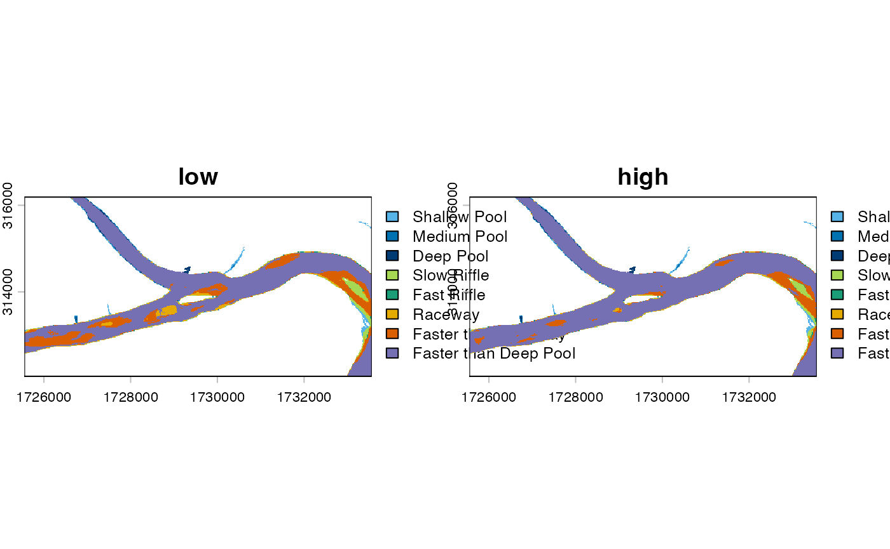
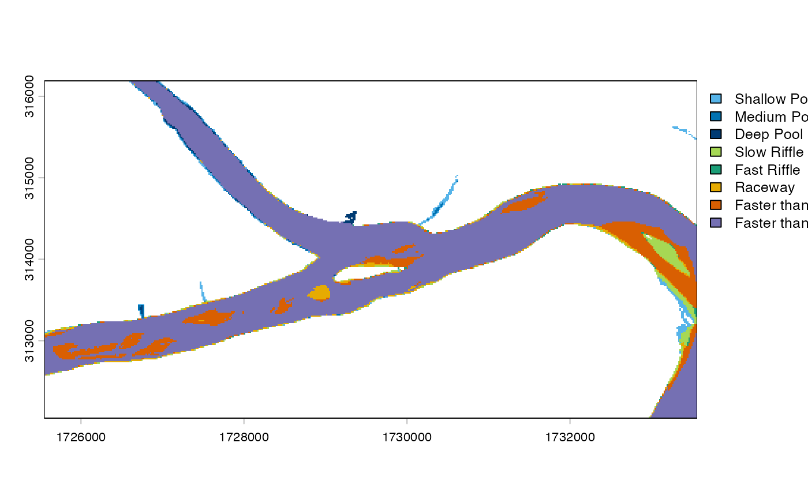

# Hydraulic scenarios

``` r

library(hydromeso)
h <- mesohabitat_example_rasters()
d2 <- h$depth * 1.25
v2 <- h$velocity * 1.15
depth <- list(low = h$depth, high = d2)
velocity <- list(low = h$velocity, high = v2)
```

Unique names pair dates or discharges safely. Unmatched or duplicated
names are rejected. Positional pairing is available only when explicitly
requested.

``` r

scenarios <- classify_mesohabitat_series(depth, velocity)
summarize_mesohabitat(scenarios)
```

    ##    scenario class_id                 label cell_count    area_m2   hectares
    ## 1       low        1          Shallow Pool        470  14148.535  1.4148535
    ## 2       low        2           Medium Pool        205   6171.170  0.6171170
    ## 3       low        3             Deep Pool        130   3913.425  0.3913425
    ## 4       low        4           Slow Riffle        823  24774.986  2.4774986
    ## 5       low        5           Fast Riffle        115   3461.876  0.3461876
    ## 6       low        6               Raceway       1036  31186.982  3.1186982
    ## 7       low        7   Faster than Raceway       3951 118937.996 11.8937996
    ## 8       low        8 Faster than Deep Pool      14604 439628.086 43.9628086
    ## 9      high        1          Shallow Pool        363  10927.485  1.0927485
    ## 10     high        2           Medium Pool        164   4936.936  0.4936936
    ## 11     high        3             Deep Pool        119   3582.289  0.3582289
    ## 12     high        4           Slow Riffle        617  18573.714  1.8573714
    ## 13     high        5           Fast Riffle        128   3853.218  0.3853218
    ## 14     high        6               Raceway        475  14299.051  1.4299051
    ## 15     high        7   Faster than Raceway       1884  56714.550  5.6714550
    ## 16     high        8 Faster than Deep Pool      17584 529335.813 52.9335813
    ##    square_kilometres       acres percentage
    ## 1        0.014148535   3.4961791  2.2030562
    ## 2        0.006171170   1.5249293  0.9609076
    ## 3        0.003913425   0.9670284  0.6093560
    ## 4        0.024774986   6.1220325  3.8576918
    ## 5        0.003461876   0.8554481  0.5390457
    ## 6        0.031186982   7.7064710  4.8560981
    ## 7        0.118937996  29.3902190 18.5197332
    ## 8        0.439628086 108.6344659 68.4541114
    ## 9        0.010927485   2.7002405  1.7015094
    ## 10       0.004936936   1.2199435  0.7687261
    ## 11       0.003582289   0.8852029  0.5577951
    ## 12       0.018573714   4.5896647  2.8920970
    ## 13       0.003853218   0.9521509  0.5999812
    ## 14       0.014299051   3.5333724  2.2264929
    ## 15       0.056714550  14.0144706  8.8309739
    ## 16       0.529335813 130.8017279 82.4224244

``` r

plot_mesohabitat(scenarios)
```



The following operation takes median depth and median velocity first and
then classifies those two surfaces:

``` r

median_result <- mesohabitat_from_median_hydraulics(depth, velocity)
names(median_result)
```

    ## [1] "median_depth"                       "median_velocity"                   
    ## [3] "mesohabitat_from_median_hydraulics"

``` r

plot_mesohabitat(median_result$mesohabitat_from_median_hydraulics)
```



This is mesohabitat derived from median hydraulics, not “median
mesohabitat.” The modal nominal class is a different operation. Ties can
return `NA` or the lowest class identifier as a deterministic
identifier-only convention.

``` r

modal_mesohabitat(scenarios, ties = "NA")
```

    ## class       : SpatRaster
    ## size        : 230, 445, 1  (nrow, ncol, nlyr)
    ## resolution  : 18, 18  (x, y)
    ## extent      : 1725550, 1733560, 312049.5, 316189.5  (xmin, xmax, ymin, ymax)
    ## coord. ref. : +proj=lcc +lat_0=38.3333333333333 +lon_0=-98 +lat_1=38.7166666666667 +lat_2=39.7833333333333 +x_0=400000 +y_0=0 +ellps=GRS80 +units=us-ft +no_defs
    ## source(s)   : memory
    ## categories  : mesohabitat
    ## name        :     modal_mesohabitat
    ## min value   :          Shallow Pool
    ## max value   : Faster than Deep Pool

``` r

compare_mesohabitat(scenarios[[1]], scenarios[[2]])
```

    ## $transitions
    ##    from_class to_class cell_count     area_m2
    ## 1           1        1        363  10927.4855
    ## 2           1        2         41   1234.2340
    ## 3           1        4         60   1806.1959
    ## 4           1        6          6    180.6196
    ## 5           2        2        123   3702.7020
    ## 6           2        3         32    963.3046
    ## 7           2        6         33    993.4078
    ## 8           2        8         17    511.7556
    ## 9           3        3         87   2618.9844
    ## 10          3        8         43   1294.4406
    ## 11          4        4        557  16767.5182
    ## 12          4        5         60   1806.1959
    ## 13          4        6        114   3431.7721
    ## 14          4        7         92   2769.5003
    ## 15          5        5         68   2047.0220
    ## 16          5        7         47   1414.8535
    ## 17          6        6        322   9693.2511
    ## 18          6        7        260   7826.8487
    ## 19          6        8        454  13666.8818
    ## 20          7        7       1485  44703.3478
    ## 21          7        8       2466  74234.6486
    ## 22          8        8      14604 439628.0860
    ## 
    ## $gains
    ##   class_id    area_m2
    ## 1        1     0.0000
    ## 2        2  1234.2340
    ## 3        3   963.3046
    ## 4        4  1806.1959
    ## 5        5  1806.1959
    ## 6        6  4605.7995
    ## 7        7 12011.2025
    ## 8        8 89707.7265
    ## 
    ## $losses
    ##   class_id   area_m2
    ## 1        1  3221.049
    ## 2        2  2468.468
    ## 3        3  1294.441
    ## 4        4  8007.468
    ## 5        5  1414.853
    ## 6        6 21493.730
    ## 7        7 74234.649
    ## 8        8     0.000
    ## 
    ## $unchanged_area_m2
    ## [1] 530088.4
    ## 
    ## $percentage_changed
    ## [1] 17.46039
